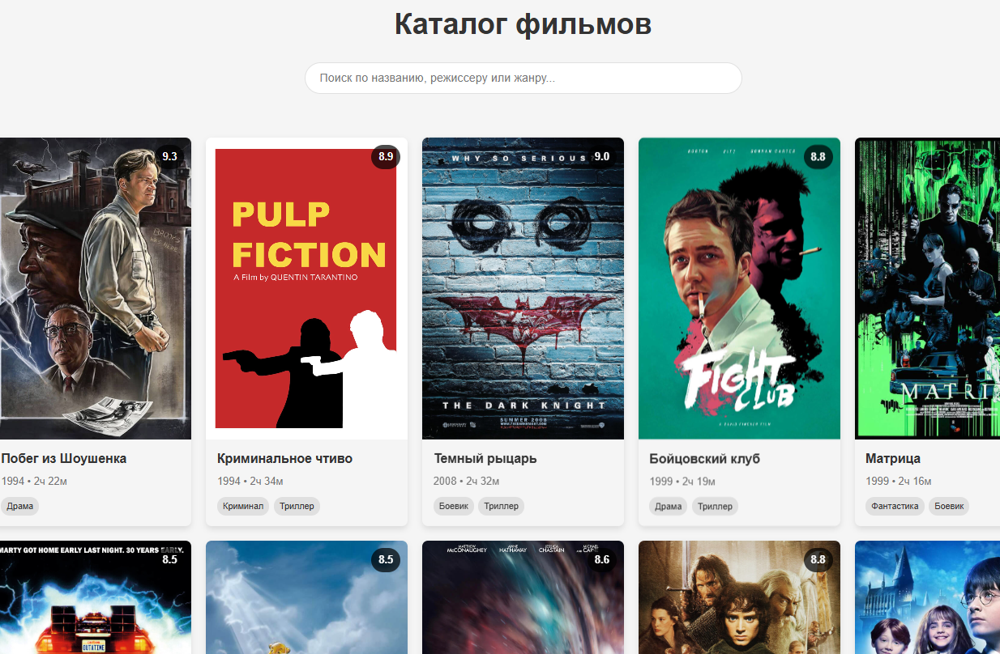

# Каталог фильмов на Angular



## Описание проекта

Каталог фильмов - это одностраничное приложение (SPA), разработанное на Angular, которое позволяет:
- Просматривать список фильмов
- Искать фильмы по названию, режиссеру или жанру
- Просматривать детальную информацию о фильме в модальном окне

## Структура проекта

```text
src/
├── app/
│ ├── components/
| | ├── loader/ - Компонент индикатора загрузки
│ │ ├── movie-card/ - Карточка фильма для списка
│ │ └── movie-dialog/ - Модальное окно с деталями фильма
│ │
│ ├── services/ - Сервисы приложения
│ ├── models/ - Модели данных
│ └── app.component.ts - Главный компонент
│
├── assets/ - Статические ресурсы постеры фильмов
│
├── styles/ - Глобальные стили
│ ├── _mixins.scss - SCSS миксины
```

## Функциональность

### Основные возможности
- Отображение списка фильмов в виде карточек
- Поиск с debounce (задержкой 300мс) и фильтрацией
- Анимация открытия/закрытия модального окна
- Адаптивный дизайн для мобильных устройств
- Индикатор загрузки данных

### Технические особенности
- Использование Angular Signals для управления состоянием
- Standalone компоненты
- Оптимизированный рендеринг списка с trackBy
- Кастомные SCSS миксины для адаптивного дизайна

## Установка и запуск

1. Клонировать репозиторий:
```bash
git clone https://github.com/tyskanhik/Movie-catalog.git
```

2. Установить зависимости:
```bash
npm install
```

3. Запустить dev-сервер:
```bash
npm start
```

Приложение будет доступно по адресу: http://localhost:4200

## Используемые технологии

-  **Angular 16+**
- **RxJS** - Реактивное программирование
- ⚡ **Signals** - Система реактивности Angular
-  **TypeScript**
-**SCSS**
-  **HTML5**
